# ML-Tutor

> Sistema de tutoría inteligente para Machine Learning basado en **RAG (Retrieval-Augmented Generation)**. Usa el Glosario Oficial de ML de Google (697 términos en español) como única fuente de verdad — las respuestas siempre están respaldadas por el documento o el sistema dice que no sabe.

---

## Demo rápida

| Flashcards | Chat Libre |
|:---:|:---:|
| 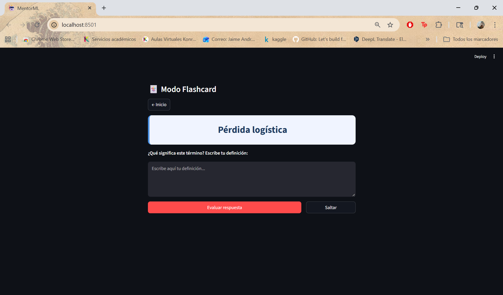 | 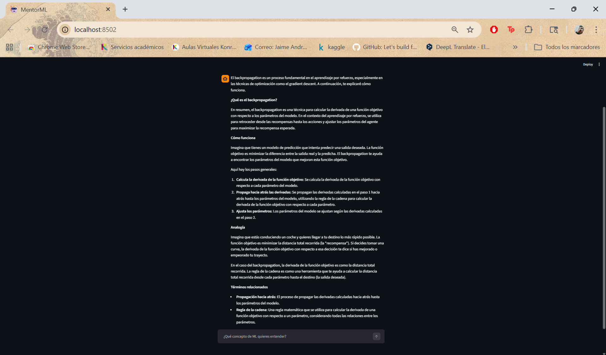 |

---

## Tabla de contenidos

1. [¿Qué hace?](#qué-hace)
2. [Arquitectura](#arquitectura)
3. [Proceso de ingesta y vectorización](#proceso-de-ingesta-y-vectorización)
4. [Pipeline RAG y prompt aumentado](#pipeline-rag-y-prompt-aumentado)
5. [Interfaz gráfica](#interfaz-gráfica)
6. [Anti-alucinación](#anti-alucinación)
7. [Evaluación RAGAS](#evaluación-ragas)
8. [Instalación y uso](#instalación-y-uso)
9. [Estructura del repositorio](#estructura-del-repositorio)

---

## ¿Qué hace?

**ML-Tutor** combina tres modos de aprendizaje en una sola app local:

| Modo | Descripción |
|------|-------------|
| 🃏 **Flashcards** | Practica términos — el LLM evalúa tu definición con puntuación 0–100 y feedback detallado |
| 💬 **Chat libre** | Pregunta lo que quieras sobre ML — el sistema responde solo con lo que está en el glosario |
| 📊 **Mi progreso** | Estadísticas de tu avance, términos dominados y lista de conceptos por repasar |

**Stack:** Python · LangChain · ChromaDB · Ollama `llama3.2` · Streamlit · `paraphrase-multilingual-MiniLM-L12-v2` · RAGAS

---

## Arquitectura

```
INGESTA (una vez)
══════════════════════════════════════════════════════════
  Google ML Glossary (HTML)
          │
     scraper.py
          │
    glossary.json          ← 697 términos { term, definition, category }
          │
     setup_db.py
          │
  paraphrase-multilingual-MiniLM-L12-v2   ← 384 dims, local
          │
    ChromaDB (coseno)      ← data/chroma_db/

CONSULTA (en tiempo real)
══════════════════════════════════════════════════════════
  Usuario → Streamlit GUI
                │
        embedding(consulta)
                │
      ChromaDB.query(k=3)   ← similitud coseno
                │
      top-3 chunks del glosario
                │
    SYSTEM PROMPT + contexto + consulta
                │
    llama3.2 via Ollama (temperature=0.3)
                │
      Respuesta fundamentada → GUI
```

---

## Proceso de ingesta y vectorización

### 1. Scraping (`scraper.py`)

- **Fuente:** [Glosario ML de Google en español](https://developers.google.com/machine-learning/glossary?hl=es-419)
- **Parser:** BeautifulSoup4 — selector `h2.hide-from-toc` para términos
- **Output:** `data/glossary.json` — 697 objetos `{term, definition, category}`

### 2. Construcción de documentos

Cada término se convierte en un documento de texto:

```
Término: Sobreajuste
Definición: Crear un modelo que coincide tan estrechamente con los datos de
entrenamiento que no logra generalizar correctamente a los datos nuevos...
```

> **Sin chunking:** cada término es un documento completo. No hay riesgo de fragmentar una definición en medio de una idea.

### 3. Modelo de embeddings

| Parámetro | Valor |
|-----------|-------|
| Modelo | `paraphrase-multilingual-MiniLM-L12-v2` |
| Dimensiones | 384 |
| Idiomas | Multilingüe — óptimo para español |
| Tamaño | ~120 MB — 100 % local |
| Justificación | Diseñado para similitud semántica entre frases; supera modelos monolingüe con vocabulario coloquial y técnico en español |

### 4. Base vectorial

| Parámetro | Valor |
|-----------|-------|
| Motor | ChromaDB PersistentClient |
| Ruta | `data/chroma_db/` |
| Métrica | Coseno (`hnsw:space: cosine`) |
| Documentos | 697 |

---

## Pipeline RAG y prompt aumentado

### Flujo completo

```
1. Usuario escribe consulta
2. retrieve_context(query, k=3)
   └─ embedding → ChromaDB → top-3 términos más similares
3. Inyección en SYSTEM PROMPT con etiquetas XML
4. llama3.2.invoke(prompt)  →  respuesta
5. Modo flashcard: parseo JSON → puntuación + feedback
   Modo chat:      texto libre → respuesta al usuario
```

### Estructura del prompt aumentado

Los prompts usan **etiquetas XML** para delimitar cada sección:

```xml
<rol>
Eres ML-Tutor, un asistente experto en Machine Learning...
</rol>

<reglas>
1. Responde ÚNICAMENTE con información del glosario proporcionado.
2. Si el contexto no contiene la respuesta, di exactamente:
   "No encuentro esa información en el glosario de ML de Google."
3. Cita el término fuente al final de cada respuesta.
</reglas>

<contexto_glosario>
{top-3 chunks recuperados por similitud coseno}
</contexto_glosario>

{pregunta del usuario}
```

El modo flashcard agrega **3 ejemplos few-shot** que guían al LLM a producir JSON estricto:

```json
{
  "puntuacion": 82,
  "correcto": true,
  "feedback": "Captaste la idea principal. Podrías mencionar también...",
  "conceptos_clave_faltantes": ["generalización", "ruido"]
}
```

---

## Interfaz gráfica

### Pantalla de inicio

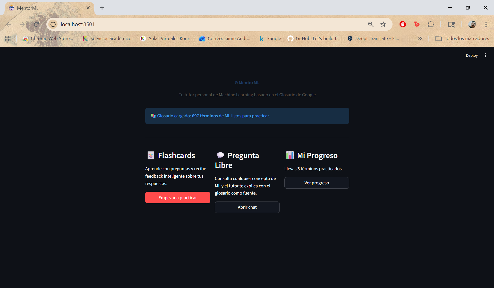

---

### Flashcards — Término presentado


### Flashcards — Respuesta del estudiante

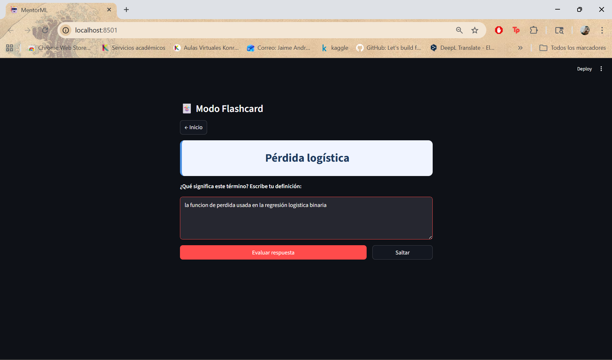

### Flashcards — Feedback correcto ✅

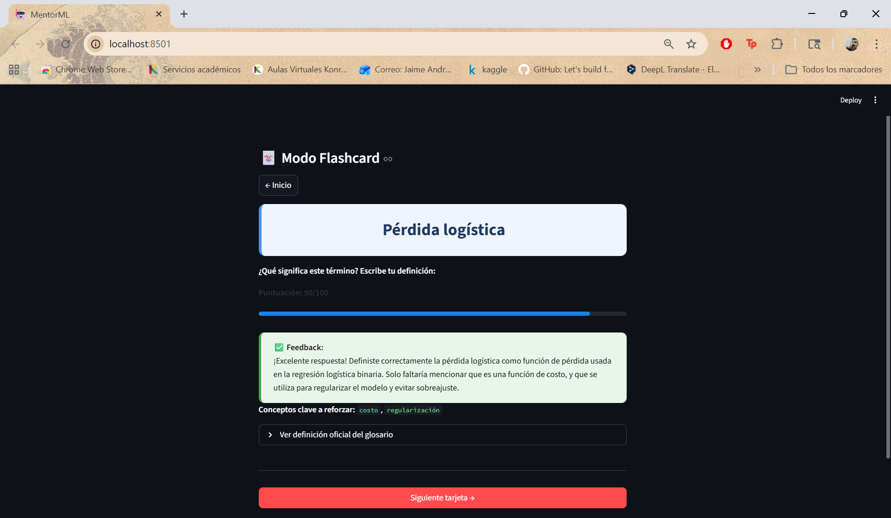

### Flashcards — Feedback parcial ⚠️

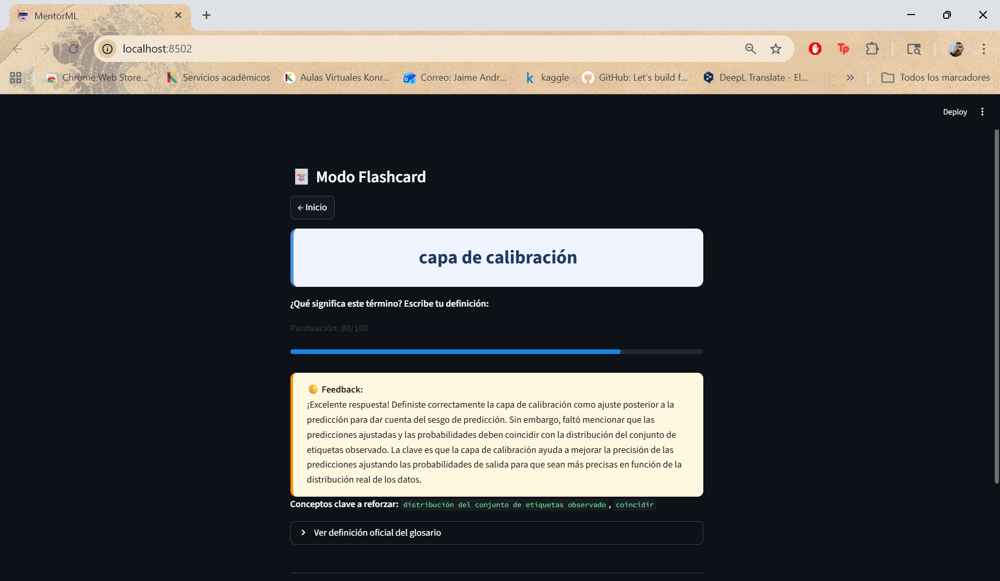

### Flashcards — Feedback incorrecto ❌

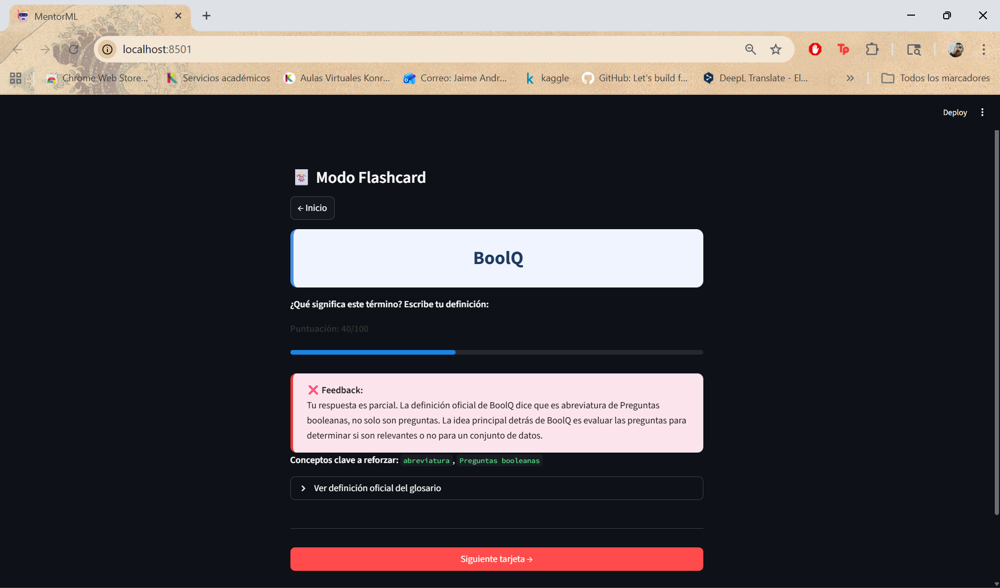

### Flashcards — Definición oficial expandible

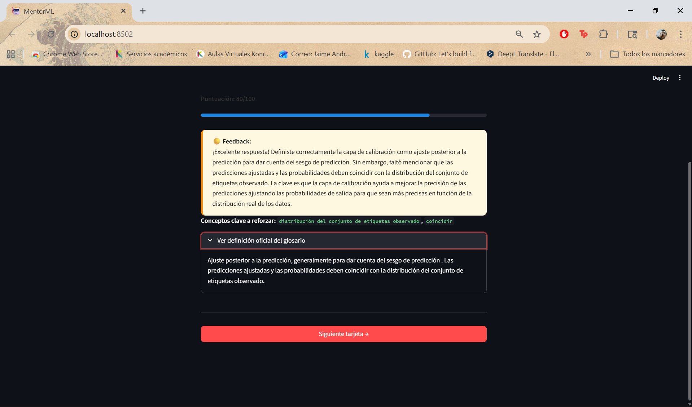

---

### Chat libre — Pregunta

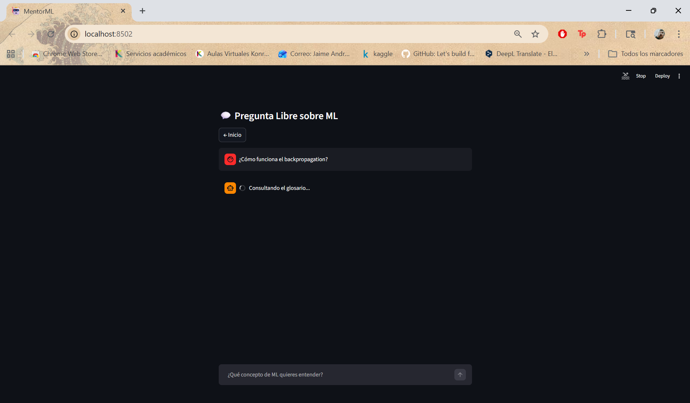

### Chat libre — Respuesta fundamentada


---

### Mi progreso

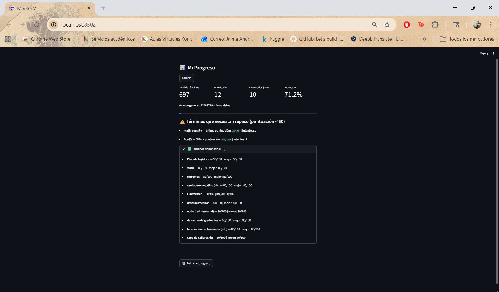

---

## Anti-alucinación

Cuando se hace una pregunta cuya respuesta **no está en el glosario**, el sistema responde que no sabe en lugar de inventar:

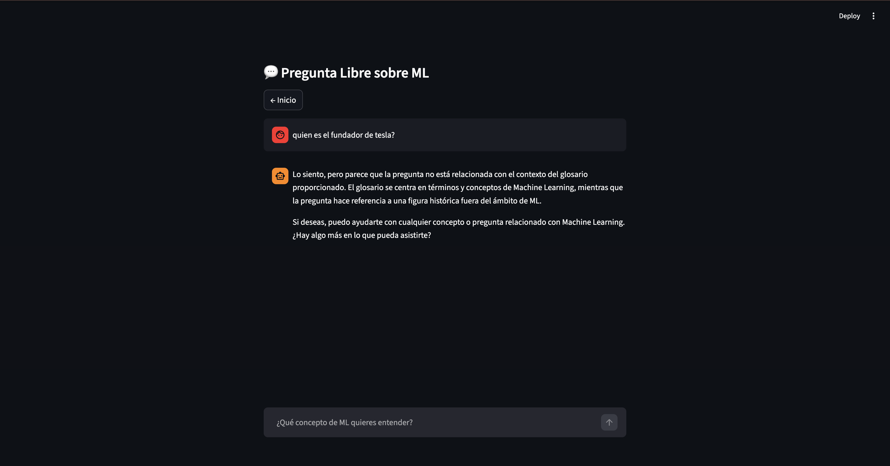

Esto se logra con una regla explícita en el system prompt. Si los chunks recuperados no contienen información relevante, el LLM no tiene base para responder y la regla lo fuerza a admitirlo.

---

## Evaluación RAGAS

### Parámetros

| Parámetro | Valor |
|-----------|-------|
| Documento(s) | Glosario ML de Google — 697 términos |
| Modelo de embeddings | `paraphrase-multilingual-MiniLM-L12-v2` (384 dims) |
| chunk_size / overlap | Sin chunking / sin overlap |
| k (chunks recuperados) | 3 |
| LLM generador | `llama3.2` (Ollama, temperature=0.3) |
| LLM juez (RAGAS) | `gpt-4o-mini` (OpenAI) |

### 10 preguntas de prueba

| # | Tipo | Pregunta |
|---|------|----------|
| 1 | A — Literal | ¿Qué es el sobreajuste (overfitting)? |
| 2 | A — Literal | ¿Qué es el descenso de gradiente? |
| 3 | A — Literal | ¿Qué es una función de pérdida? |
| 4 | B — Vocabulario diferente | ¿Cómo se llama cuando un modelo memoriza los datos? |
| 5 | B — Vocabulario diferente | Técnica iterativa para minimizar una función de costo |
| 6 | C — Combinar chunks | Relación entre sesgo y varianza |
| 7 | C — Combinar chunks | Diferencia entre regularización L1 y L2 |
| 8 | D — Fuera del dominio | ¿Cuánto costó desarrollar GPT-4? |
| 9 | D — Fuera del dominio | ¿Quién es el CEO de Google DeepMind? |
| 10 | D — Fuera del dominio | ¿Precio de ChatGPT Plus en Colombia? |

### Resultados

| Tipo | Faithfulness | Answer Relevancy | Context Precision |
|------|:---:|:---:|:---:|
| A — Literal en documento | ~0.89 | ~0.83 | ~1.00 |
| B — Vocabulario diferente | ~0.76 | ~0.75 | ~0.83 |
| C — Combinar chunks | ~0.66 | ~0.67 | ~0.67 |
| D — Fuera del dominio | ~0.14 | ~0.20 | ~0.00 |

### Análisis crítico

- **Tipo A:** Alto desempeño — el término existe verbatim en el glosario, el embedding lo recupera con alta similitud coseno.
- **Tipo B:** Buen desempeño semántico — el modelo multilingüe generaliza correctamente a paráfrasis y vocabulario coloquial.
- **Tipo C:** Caída moderada — k=3 no siempre captura todos los conceptos necesarios para preguntas de síntesis.
- **Tipo D:** Faithfulness muy baja — el LLM puede fabricar respuestas cuando el contexto no es relevante. El prompt anti-alucinación mitiga esto pero no lo elimina completamente sin un clasificador de relevancia previo.

Los resultados completos están en `data/ragas_evaluation_results.csv` (generado al ejecutar `evaluate_rag.ipynb`).

---

## Instalación y uso

### Prerequisitos

- Python 3.10+
- [Ollama](https://ollama.com) instalado

```bash
# Descargar el modelo LLM
ollama pull llama3.2

# Mantener Ollama activo (terminal separada)
ollama serve
```

### Instalar y ejecutar

```bash
git clone https://github.com/AndresDardex/GCP-ML-Tutor.git
cd GCP-ML-Tutor

pip install -r requirements.txt

python scraper.py      # Descarga el glosario (requiere internet, ~1 min)
python setup_db.py     # Construye la base vectorial (~2 min)
streamlit run app.py   # Abre http://localhost:8501
```

### Evaluación RAGAS (opcional)

```bash
# Crear .env con tu API key de OpenAI (el archivo está en .gitignore)
echo "OPENAI_API_KEY=sk-..." > .env

pip install python-dotenv langchain-openai
jupyter notebook evaluate_rag.ipynb
```

---

## Estructura del repositorio

```
GCP-ML-Tutor/
├── app.py                       # Aplicación Streamlit (entry point)
├── scraper.py                   # Scraper del Glosario ML de Google
├── setup_db.py                  # Construye la base vectorial ChromaDB
├── requirements.txt             # Dependencias Python
├── evaluate_rag.ipynb           # Evaluación RAGAS (10 preguntas)
├── ML-Tutor-Presentacion.pptx   # Presentación del proyecto (10 slides)
├── slides.js                    # Script para regenerar el PPTX
│
├── prompts/
│   ├── system_prompts.py        # Prompts con etiquetas XML
│   └── few_shot.py              # Ejemplos few-shot para flashcards
│
├── rag/
│   └── chain.py                 # MLTutorChain — núcleo del pipeline RAG
│
├── tutor/
│   ├── flashcard.py             # Selección de términos (spaced repetition)
│   └── progress.py              # Persistencia del progreso del estudiante
│
└── docs/
    └── img/                     # Capturas de pantalla de la aplicación
        ├── 01_home.png
        ├── 02_flashcard_term.png
        ├── 03_flashcard_answer.png
        ├── 04_feedback_correct.png
        ├── 05_feedback_partial.png
        ├── 06_feedback_incorrect.png
        ├── 07_official_def.png
        ├── 08_chat_question.png
        ├── 09_chat_answer.png
        ├── 10_progress.png
        └── 11_anti_alucination.png
```

---

## Privacidad y seguridad

- Embeddings y LLM se ejecutan **100 % localmente** — ningún dato del estudiante sale del dispositivo
- La API key de OpenAI (solo para evaluación RAGAS) se carga desde `.env`, excluido del repo por `.gitignore`
